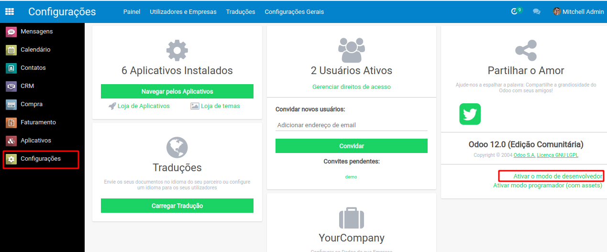

# Funcionamento básico

Para importar dados no Odoo, basta clicar no botão _Import_ da página do tipo de objeto desejado.

A complexidade da importação de dados no Odoo vem da complexidade em registrar em Odoo **as relações** entre os objetos importados.

## Como importar relações entre objetos ?

Um exemplo : um dos campos de um _Contato_ é o campo _Marcadores_ \(chamado também de "categoria de contato", ou "Tag do contato"\). Para associar cada contato importado com um Marcador específico teremos que :

1.  Importar todos os _Marcadores_ **antes** de importar os _Contatos_.
2. Durante a importação dos _Contatos_ teremos que indicar os _**External ID**_ dos _Marcadores_  de cada _Contato_ importado, para indicar qual _Marcador_ vai ser associado a qual _Contato_.

O _External ID_, chamado também de _**XML ID**_, é o identificador de um objeto presente em Odoo. Ele permite permite fazer a diferença por exemplo entre dois _Marcadores_ que teriam o mesmo nome no Odoo apesar de ser dois objetos distintos do mesmo tipo _'Marcador'_.


É importante anotar a [diferença entre o External ID de um de um objeto e o ID no banco de dados](https://www.odoo.com/documentation/user/12.0/general/base_import/import_faq.html#what-s-the-difference-between-database-id-and-external-id) desse mesmo objeto.

Os dois são um identificador único do mesmo objeto, porém o ID no banco de dados é um **número** \(único\) dado automaticamente por Odoo quando cria \(ou importa\) esse novo objeto, enquanto o External ID é uma **cadeia de caracteres** que pode ser dada pelo usuário durante a importação do objeto.


É possível conhecer o External ID de um objeto diretamente pela **interface** do Odoo ou quando **exporta** dados Odoo para arquivos \(Excel ou CSV\).

## External ID pela interface

Primeiro precisa ativar o modo "desenvolvedor" do Odoo no painel de Configurações gerais :

Depois ir na página do objeto desejado, por exemplo esse Marcador de contato \(chamado também de "Tag do contato", acessível pelo menu _Contatos_ &gt; _Configuração_ &gt; _Tags do contato_\), clicar na barata que apareceu \(encima na direita\), e abrir _Visualizar Metadata_ do objeto corrente :

Aparece então as suas Metadatas, incluindo o **ID XML** \(outro nome para o External ID\), diferente  do ID 'simples' que é o identificador do objeto no banco de dados \(que não precisamos usar\) :

## External ID na exportação

Para exportar dados do Odoo para arquivos Excel \(ou CSV\), é preciso fazer aparecer os objetos para ser exportados em visualização '**lista**'. Isso permite selecionar os objetos para serem exportados. Quando selecionar um objeto aparece o botão **Ação** que permite, entre outras coisas, exportar os dados dos objetos selecionados :

Ao exportar _Marcadores_ de contato, para seguir o nosso exemplo, basta selecionar a opção '_Update data_' para fazer aparecer o campo '_ID Externo_' dentro dos campos disponíveis :

O resultado é um arquivo Excel com a lista dos _External ID_ de cada _Marcador_ :

## Criação do External ID durante a importação

A força desse _External ID_  é que ele pode ser dado a um objeto pelo usuário durante a importação.

Por exemplo, se eu importar o seguinte arquivo Excel :

Basta clicar no botão _Import_ &gt; _Carregar Arquivo_ da página '_Tags do Contato_' e selecionar o arquivo para importar. Odoo reconhece o significação das colunas do meu arquivo mas é sempre possível escolher manualmente o destino de cada uma :


Caso não preencher a casa "External ID", Odoo criará-lo automaticamente e importará o objeto mesmo assim.


Podemos verificar pela interface que o _External ID_ de cada _Marcador_  importado corresponde à cadeia de caracteres indicada no arquivo de importação. Será então possível usar esse mesmo _External ID_ no futuro, por exemplo durante a importação dos Contatos para indicar o _Marcador_ de cada _Contato_ :

## Relação pai / filho

Na mesma ideia que para importar a informação da relação entre dois objetos de tipos diferentes, o jeito mais simples e seguro de importar as relações entre dois objetos do mesmo tipo é de :

1. importar os pais
2. importar os filhos, indicando para cada filho o External ID do\(s\) pai\(s\) previamente importados

Por exemplo, importando o arquivo :

Eu vou poder importar 2 _Marcadores_ como sub-categorias de contato da categoria pai "_Meu Marcador importado 1_" :


Na teoria é possível importar junto no mesmo arquivo .xls ou .CSV os objetos pai e filho de uma vez. Porém é mais complexo e é fonte de erros, por isso recomendamos de realizar esse tipo de importações pai/filho em duas vezes.


## FAQ oficial da Odoo S.A.

Para questões técnicas específicas sobre a importação :



