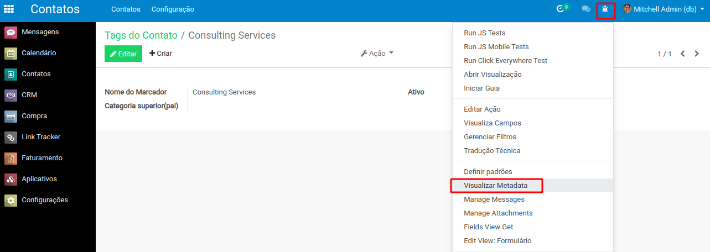

# Funcionamento

## O que é o External ID ?

A complexidade da importação de dados no Odoo vem da complexidade em registrar em Odoo **as ligações** entre os objetos importados.

Por exemplo, um dos campos de um _Contato_ é o campo dos _Marcadores_ \(ou "categoria de contato"\). Entendemos que teremos que importar todos os _Marcadores_ primeiro antes de importar os _Contatos_, e durante a importação dos _Contatos_ teremos que indicar os _**External ID**_ dos _Marcadores_  de cada _Contato_ importado.

O _External ID_, chamado também de _**XML ID**_, é o identificador de um objeto presente em Odoo. Ele permite permite fazer a diferença por exemplo entre dois _Contatos_ que teriam o mesmo nome no Odoo apesar de ser dois objetos distintos do mesmo tipo _'Contato'_.


É importante anotar a [diferença entre o External ID de um de um objeto e o ID no banco de dados](https://www.odoo.com/documentation/user/12.0/general/base_import/import_faq.html#what-s-the-difference-between-database-id-and-external-id) desse mesmo objeto.

Os dois são um identificador único do mesmo objeto, porém o ID no banco de dados é um **número** \(único\) dado automaticamente por Odoo quando cria \(ou importa\) esse novo objeto, enquanto o External ID é uma **cadeia de caracteres** que pode ser dada pelo usuário durante a importação do objeto.


É possível conhecer o External ID de um objeto diretamente pela **interface** do Odoo ou quando **exporta** dados Odoo para arquivos \(Excel ou CSV\).

## Pela interface

Pela interface, precisa primeiro ativar o modo "desenvolvedor" do Odoo no painel de Configurações gerais :

Depois ir na página do objeto desejado, por exemplo esse Marcador de contato \(chamado também de "Tag do contato", acessível pelo menu _Contatos_ &gt; _Configuração_ &gt; _Tags do contato_\), clicar na barata que apareceu encima na direita, e abrir _Visualizar Metadata_ do objeto corrente :

Aparece então as suas Metadatas, incluindo o **ID XML** \(outro nome para o External ID\), diferente  do ID 'simples' que é o identificador do objeto no banco de dados \(que não precisamos usar\) :

## Na exportação e importação

